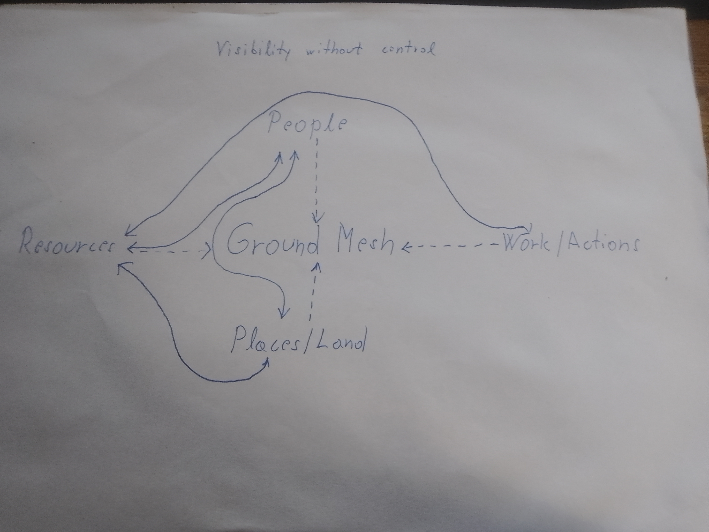

---

This shows how people, land, work, and resources are already connected.

Nothing here is owned or controlled.  
It simply makes relationships visible, so decisions can be made more clearly and fairly.

When connections are visible, power doesn’t need to be hidden.
